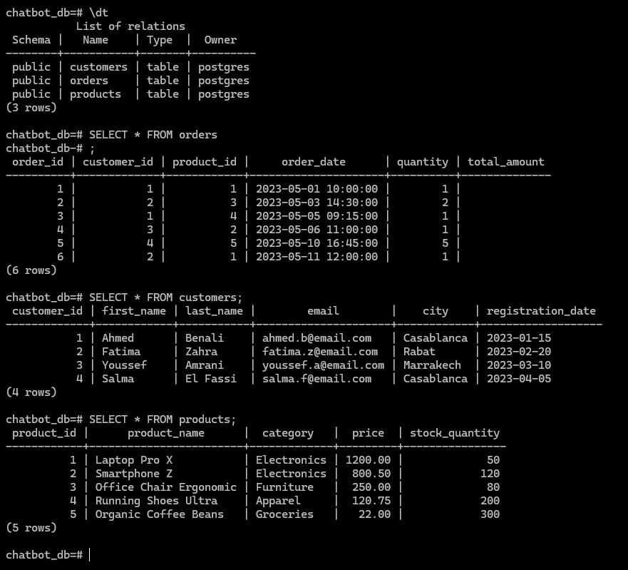
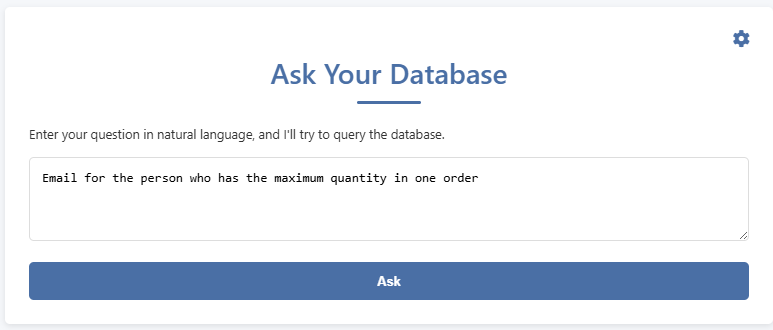
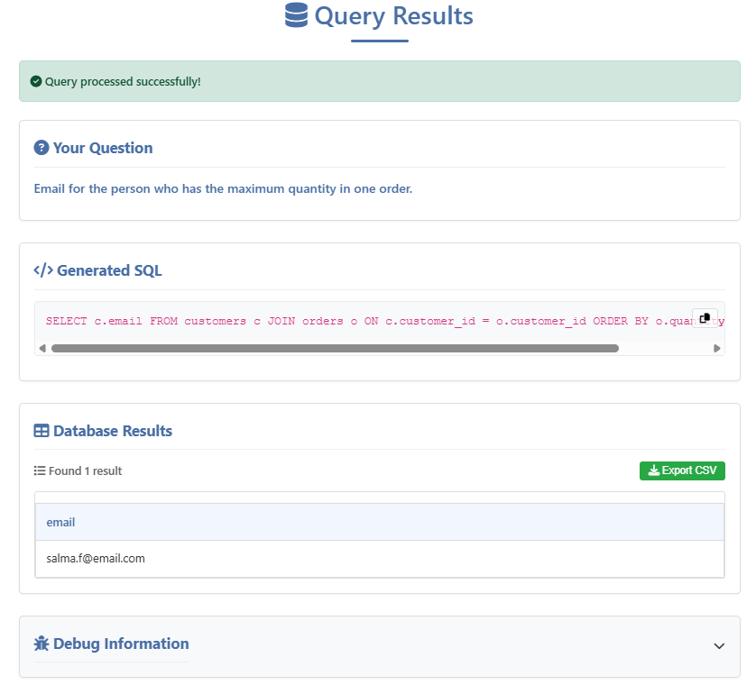

# SQL Query Assistant 🔍 | Natural Language to SQL Converter


## 💫 Project Overview

**SQL Query Assistant** transforms natural language questions into SQL queries using advanced AI. Perfect for database analysts, developers, and business users who want to query databases without writing SQL code.

Built with cutting-edge AI technology (Google Gemini Pro + LangChain), SQL Query Assistant understands your intent and generates accurate SQL queries in seconds.

## ✨ Key Features

- 🗣️ **Natural Language Understanding** - Ask questions in plain English or French
- 🤖 **Advanced AI Translation** - Powered by Google Gemini Pro for accuracy
- 🛠️ **Query Validation** - Multi-stage validation ensures query correctness
- 🔍 **Intent Analysis** - Understands the meaning behind your questions
- 🎯 **Auto-Correction** - Fixes typos and spelling mistakes in your questions
- 🎨 **Intuitive Interface** - Clean, responsive design with light/dark theme
- 📊 **Interactive Results** - View query results with sorting and export options
- 📋 **SQL Copy & Export** - One-click copy of generated SQL or export of results

## 🖼️ Screenshots

<div style="text-align: center;">
  <br>
  <em>Tables in the database</em><br><br>
    <br>
  <em>Home page interface</em><br><br>
  <br>
  <em>Query results with SQL and data visualization</em>
</div>

## 🧰 Technology Stack


- **Backend**: Python 3.12+, Flask
- **Database**: PostgreSQL
- **Frontend**: HTML5, CSS3, JavaScript
- **AI & Orchestration**: Google Generative AI (Gemini Pro), LangChain
- **Query Pipeline**: Multi-stage SQL generation and validation

## 🚀 Quick Start

### Prerequisites

- Python 3.12 or higher
- PostgreSQL database
- [Google Gemini API Key](https://ai.google.dev/) (Required)

### Installation

```bash
# Clone the repository
git clone https://github.com/anass1209/NL2SQL.git
cd NL2SQL

# Method 1: Using Poetry (Recommended)
poetry install
# Run the application
cd src
poetry run python app.py

# Method 2: Using pip
pip install -e .
# Run the application
cd src
python app.py
```

### Environment Setup

Create a `.env` file in the root directory with the following variables:

```
FLASK_SECRET_KEY=your_secret_key(random)
DB_HOST=localhost
DB_PORT=5432
DB_NAME=chatbot_db
DB_USER=chatbot_user
DB_PASSWORD=your_password
GOOGLE_API_KEY=your_google_api_key
```

Then open your browser to `http://localhost:5010`

## 📋 Usage Guide

1. **Configure API Keys**: Enter your Google Gemini API key using the settings icon
2. **Ask a Question**: Type your question in natural language (e.g., "Show me all customers from Casablanca")
3. **View Results**: See the generated SQL query and the database results
4. **Explore Data**: Use the interactive table to sort and analyze your results
5. **Export Results**: Download the data as CSV for further analysis
6. **Copy SQL**: Copy the generated SQL to use in your own applications

## 🔄 How It Works

SQL Query Assistant uses a sophisticated AI pipeline to translate your questions:

1. **Intent Analysis**: Analyze the user's question to understand the intent and extract key entities
2. **Query Correction**: Automatically fix typos and clarify ambiguous questions
3. **Schema Matching**: Match the intent to the database schema
4. **SQL Generation**: Generate syntactically correct SQL using the LLM
5. **Query Validation**: Validate the generated SQL against the database schema
6. **Query Execution**: Execute the SQL against the database
7. **Results Presentation**: Format and display the results in an interactive table

## 📂 Project Structure

```
NL2SQL/
├── app.py                 # Main Flask application
├── sql_pipeline.py        # NL to SQL conversion pipeline
├── utils.py               # Utility functions
├── db_utils.py            # Database connection utilities
├── populate_db.py         # Database population script
├── pyproject.toml         # Project dependencies (Poetry)
├── README.md              # This documentation
├── .env                   # Environment variables (create this)
├── src/
│   ├── seq2sql2seq/       # Core package
│   ├── static/            # Static assets
│   │   ├── css/           # CSS stylesheets
│   │   ├── js/            # JavaScript files
│   │   └── img/           # Images and icons
│   └── templates/         # HTML templates
│       ├── index.html     # Home page template
│       └── result.html    # Results page template
└── tests/                 # Test suite
```

## 🔍 Use Cases

- **Database Developers**: Quickly prototype SQL queries
- **Business Analysts**: Access database insights without SQL knowledge
- **Data Scientists**: Explore datasets through natural language
- **Customer Support**: Enable quick data lookups without technical skills
- **Managers**: Get data-driven insights with simple questions

## 🚧 Roadmap

- [ ] Add support for more complex queries (aggregations, joins)
- [ ] Implement query history tracking
- [ ] Add visualization options for query results
- [ ] Support multiple database types (MySQL, SQLite, etc.)
- [ ] Create shareable query links
- [ ] Add query optimization suggestions

## 🤝 Contributing

Contributions are welcome! Please feel free to submit a Pull Request.

1. Fork the repository
2. Create your feature branch (`git checkout -b feature/amazing-feature`)
3. Commit your changes (`git commit -m 'Add some amazing feature'`)
4. Push to the branch (`git push origin feature/amazing-feature`)
5. Open a Pull Request

## 📄 License

This project is licensed under the MIT License - see the [LICENSE](LICENSE) file for details.

## 🙏 Acknowledgements

- [Google Generative AI](https://ai.google.dev/)
- [LangChain](https://www.langchain.com/)
- [Flask](https://flask.palletsprojects.com/)
- [PostgreSQL](https://www.postgresql.org/)

---

<div align="center">

⭐ **Star this repo if you find it useful!** ⭐

[Report Bug](https://github.com/anass1209/NL2SQL/issues) · [Request Feature](https://github.com/anass1209/NL2SQL/issues)

</div>
